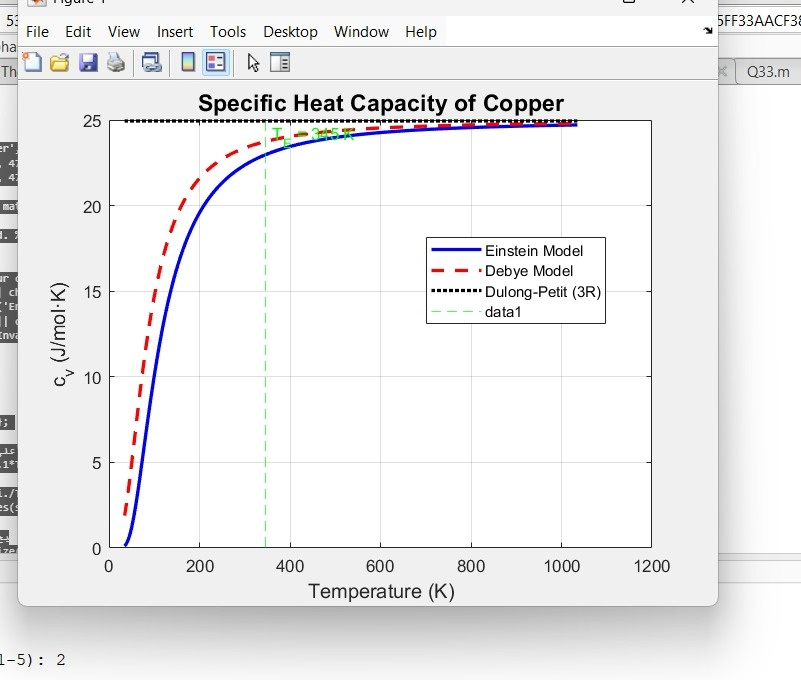
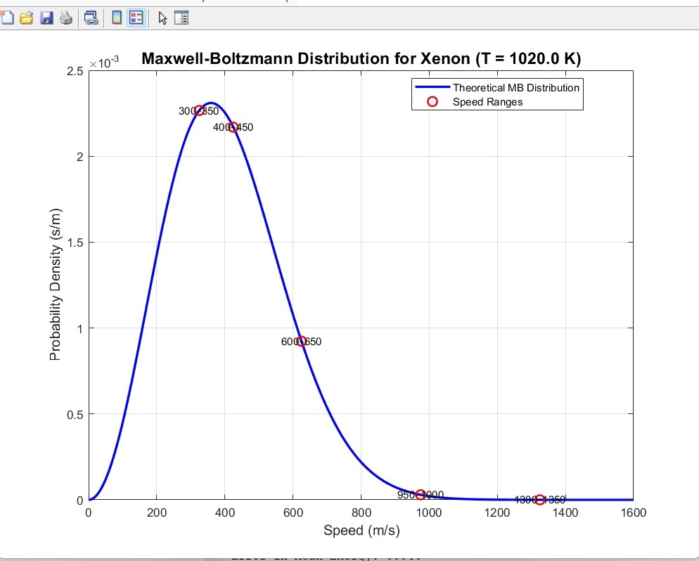
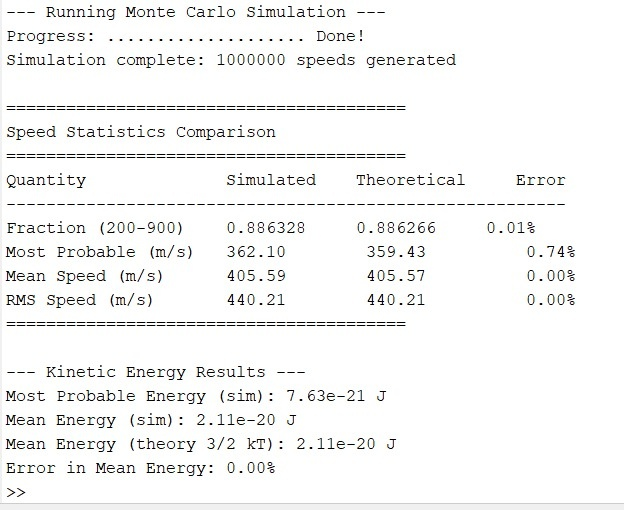
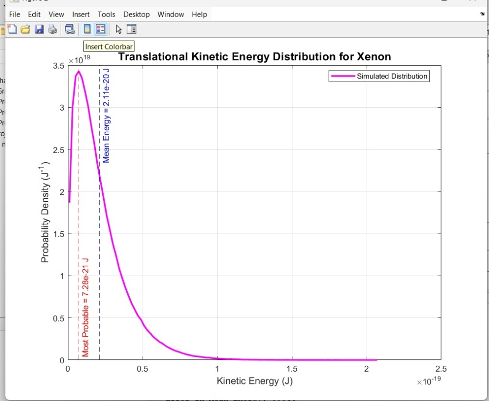
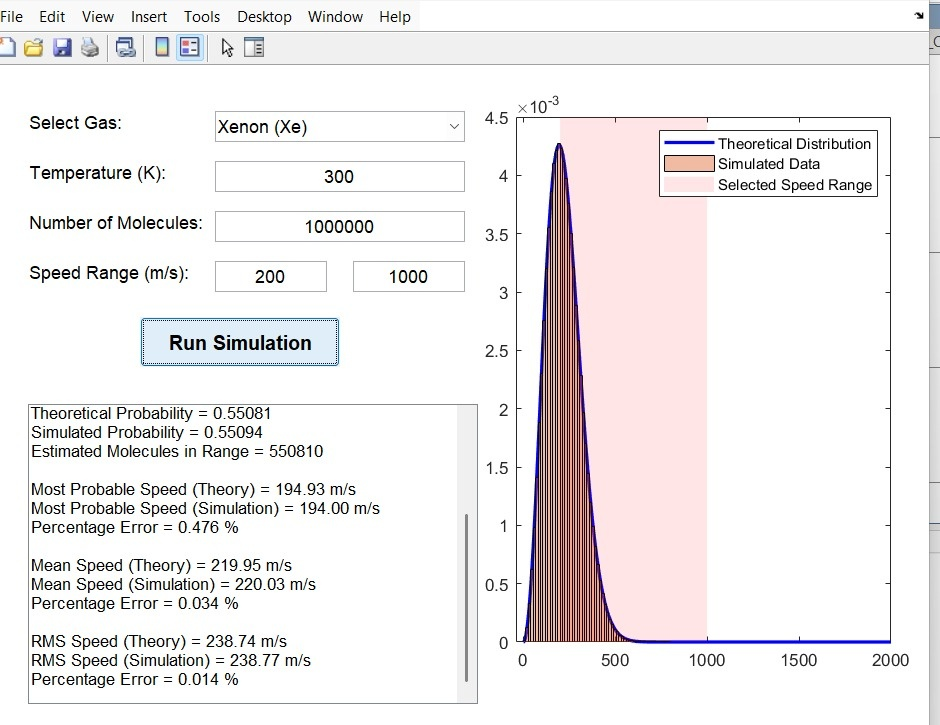
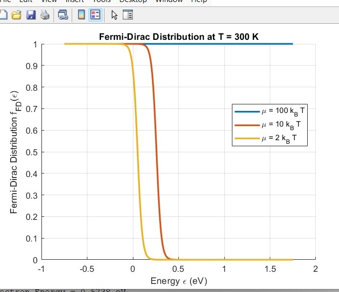
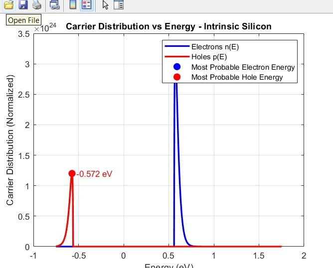
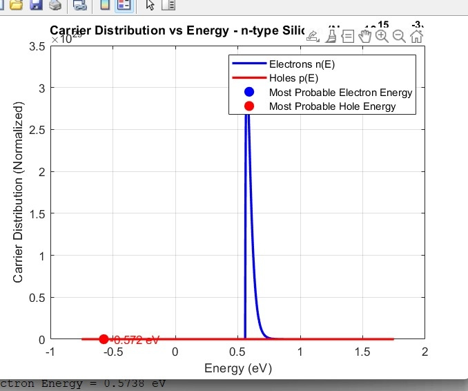
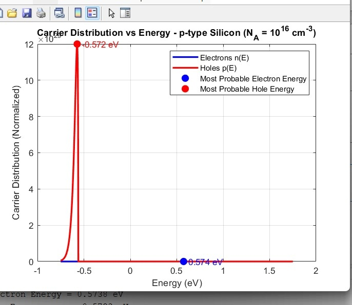
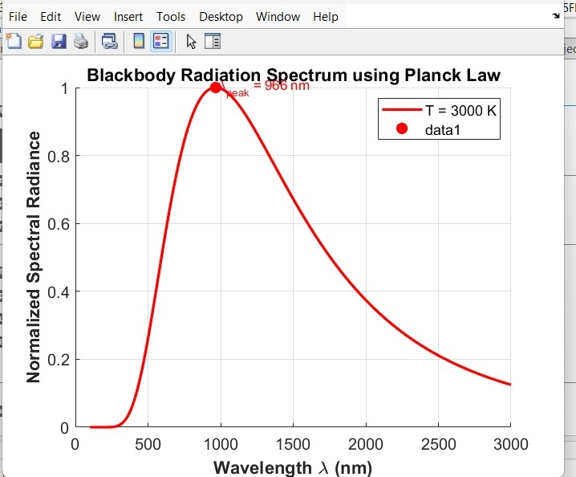

# Computational Statistical & Thermal Physics Simulator

An integrated suite of MATLAB-based numerical simulation tools developed to model, analyze, and visualize fundamental phenomena in thermal, quantum, and semiconductor statistical mechanics. This toolbox bridges microstate statistical laws with macrostate thermodynamic observables—spanning solid-state lattice dynamics, molecular gas kinetics, semiconductor carrier statistics, and blackbody quantum radiation fields.

---

## Technical Project Modules

### 1. Lattice Dynamics & Specific Heat Anomalies
Models the molar specific heat capacity ($C_v$) of crystalline solids by solving the quantum-mechanical **Einstein Model** and **Debye Model Approximations**.
* **Engine Scope:** Evaluates quantum freeze-out effects at low temperatures where thermal energy ($k_B T$) is insufficient to excite vibrational modes, tracking convergence to the classical high-temperature **Dulong-Petit law limit ($C_v = 3R \approx 24.94 \text{ J/mol}\cdot\text{K}$)**.
* **Simulated Configuration Cases:** Sweeps temperatures up to $2 \times T_E$ across distinct characteristic material footprints: Silver ($T_E = 225\text{ K}$), Copper ($T_E = 345\text{ K}$), Iron ($T_E = 470\text{ K}$), Silicon ($T_E = 645\text{ K}$), and Diamond ($T_E = 1320\text{ K}$).

---

### 2. Stochastic Maxwell-Boltzmann Molecular Gas Simulator
A dual-engine computational framework consisting of an analytical optimization solver and a stochastic **Monte Carlo Acceptance-Rejection** sampler to analyze ideal gas velocity fields.
* **Core Functions & Processing:**
  * **Temperature Approximation:** Reconstructs macrostate thermodynamic equilibrium temperature ($T \approx 300\text{ K}$) from discrete, localized molecular velocity datasets via a least-squares error minimization loop.
  * **Stochastic Profile:** Generates $10^6$ randomized molecular speed states to compute and benchmark simulated vs. theoretical kinetic metrics ($v_{mp} < v_{mean} < v_{rms}$).
  * **Kinetic Energy Profile:** Resolves translational kinetic energy distributions, verifying the Equipartition Theorem where mean energy settles exactly at $\frac{3}{2}k_B T$.
* **Gas Variant Profile:** Configured for **Xenon (Xe)** ($M = 131.29 \text{ g/mol}$). Includes a cross-platform **Bonus GUI Application** evaluating a 10-gas inventory up to a $10^8$ particle limit.

#### Simulation Visualizations

| Velocity Fitting Metrics (Histogram) | Ideal Speed Density Profile (Theoretical) |
|:---:|:---:|
|  |  |

| Translational Kinetic Energy Spectrum | Interactive Simulator Interface (Bonus UI) |
|:---:|:---:|
|  |  |

---

### 3. Fermi-Dirac Statistics & Semiconductor Carrier Extraction
Maps quantum state occupancy dynamics for spin-$\frac{1}{2}$ indistinguishable fermions obeying the Pauli Exclusion Principle across semiconductor band structures.
* **Case A: Pure Fermi-Dirac Mathematical Boundaries**
  * Sweeps occupancy behavior across independent temperature steps ($T = 80\text{ K}$ and $T = 300\text{ K}$) under varying chemical potential benchmarks ($\mu = 100k_B T$, $\mu = 10k_B T$, and $\mu = 2k_B T$).
* **Case B: Real-World Semiconductor Substrate Profile**
  * Couples Fermi-Dirac distribution functions with 3D parabolic Density of States (DOS) profiles ($N_c(E) \propto \sqrt{E-E_c}$ and $N_v(E) \propto \sqrt{E_v-E}$) to calculate localized carrier concentrations.
  * Simulates **Silicon ($E_g = 1.12 \text{ eV}$, $n_i = 10^{10} \text{ cm}^{-3}$ at $300\text{ K}$)** under three specific state configurations: *Intrinsic Silicon* ($E_F = E_{Fi}$), *n-type Silicon* ($N_D = 10^{15} \text{ cm}^{-3}$ shifting $E_F$ toward $E_c$), and *p-type Silicon* ($N_A = 10^{16} \text{ cm}^{-3}$ shifting $E_F$ toward $E_v$).

#### Simulation Visualizations

| Fermi Function Occupancy Decays (Part A) | Intrinsic Substrate Density (Part B) |
|:---:|:---:|
|  |  |

| Extrinsic n-type Carrier Profile (Part B) | Extrinsic p-type Carrier Profile (Part B) |
|:---:|:---:|
|  |  |

#### Command Window Extraction Logs

<b>Click to expand semiconductor energy calculation logs</b>

Below are the numerical values extracted from the continuous data loops, marking exactly where carrier concentrations peak across varying doping layers:

---

### 4. Quantum Blackbody Spectral Radiance & Boson Kinetics
Simulates electromagnetic energy spectral density profiles emitted by ideal blackbodies, resolving the classical Rayleigh-Jeans "ultraviolet catastrophe" via Bose-Einstein photon statistics.
* **Engine Scope:** Sweeps normalized spectral radiance $B(\lambda, T)$ using Planck's Radiation Law across custom high-temperature thresholds over a $100 \text{ nm}$ to $3000 \text{ nm}$ band.
* **Wien's Displacement Law Verification:** Automatically marks coordinates to trace inverse peak wavelength scaling relative to thermal spikes:
  * $T = 3000\text{ K} \rightarrow \lambda_{peak} \approx 966\text{ nm}$ (Near-Infrared footprint)
  * $T = 4000\text{ K} \rightarrow \lambda_{peak} \approx 725\text{ nm}$ (Visible Threshold / Deep Red)
  * $T = 5000\text{ K} \rightarrow \lambda_{peak} \approx 580\text{ nm}$ (Visible / Solar Yellow-Green peak)

---

## Governing Physical Frameworks

### Debye Lattice Model Integrator
$$C_{v,\text{Debye}} = 9R\left(\frac{T}{T_D}\right)^3 \int_{0}^{T_D/T} \frac{t^4 e^t}{(e^t-1)^2} dt$$

### Maxwell-Boltzmann Speed Distribution
$$f(v) = 4\pi \left(\frac{m}{2\pi k_B T}\right)^{3/2} v^2 e^{-\frac{mv^2}{2k_B T}}$$

### Planck's Radiation Law (Bose-Einstein Distribution Engine)
$$B(\lambda, T) = \frac{2hc^2}{\lambda^5} \frac{1}{e^{\left(\frac{hc}{\lambda k_B T}\right)} - 1}$$

---

## Technical Architecture & Development
* **Environment:** MATLAB R2026a / GNU Octave Compatibility
* **Core Functions Applied:** `integral` (Numerical Quadrature Integration), `histcounts` (Stochastic Bin Sorting), `uicontrol` / Programmatic UI Callbacks.
* **Project Developers:** Mahmoud Mohamed & Mohamed Said Tolba (Faculty of Engineering, Ain Shams University).# statistical-and-thermal-physics-simulator
